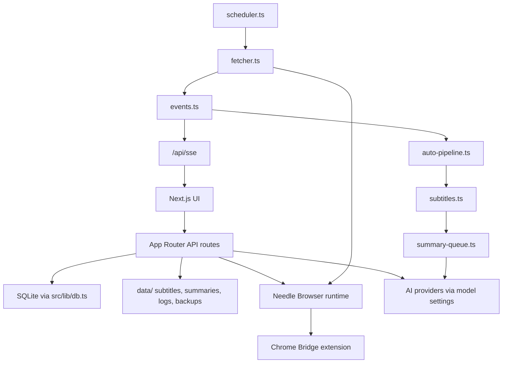
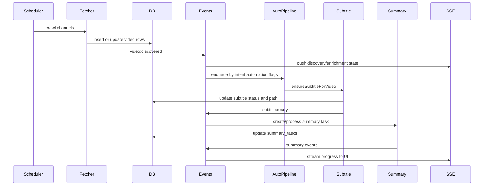

# Project Details

[中文版](./project-details.zh.md)

Last source scan: 2026-05-30.

This document describes current source behavior. Older files under `docs/design/` and `docs/specs/` are useful history, but should be verified before being treated as live implementation.

## Top-Level Map

| Path | Role |
| --- | --- |
| `src/app/` | Next.js App Router pages and API routes |
| `src/components/` | React UI components |
| `src/components/settings/` | Settings tab components |
| `src/lib/` | Server-side database, crawler, pipeline, AI, browser, backup, research logic |
| `src/hooks/` | Client hooks such as Media Session support |
| `src/contexts/` | Theme, language, performance contexts |
| `src/mcp-server/` | stdio MCP server for intent agents |
| `browser-runtime/` | First-party browser daemon CLI |
| `browser-bridge/extension/` | Chrome extension source |
| `browser-bridge-package/` | Prebuilt extension artifacts |
| `eval/` | Subtitle pipeline evaluation harness |
| `scripts/` | Backup, restore, stop, export, and runtime helper scripts |
| `data/` | Runtime data, gitignored |

## Runtime Data Layout

```text
data/
  folo.db
  subtitles/<platform>/<videoId>/
  summaries/<platform>/<videoId>.md
  summary-md/<platform>/<videoId>.md
  agent-artifacts/<intentName>/
  logs/
  backups/
```

## Architecture



Core singleton services use `globalThis` to survive Next.js hot reloads: scheduler, manual refresh state, auto-pipeline, summary queue, events, and shared AI budget.

## Main Pages

| Route | File | Purpose |
| --- | --- | --- |
| `/` | `src/app/page.tsx` | Video feed with intent/topic/platform filtering |
| `/channels` | `src/app/channels/page.tsx` | Channel management |
| `/settings` | `src/app/settings/page.tsx` | Settings shell with `?tab=` routing |
| `/research` | `src/app/research/page.tsx` | Research favorites workspace |
| `/research/collections/[id]` | `src/app/research/collections/[id]/page.tsx` | Collection detail page |

## API Route Inventory

Routes are scanned from `src/app/api/**/route.ts`.

| Group | Routes |
| --- | --- |
| Backup | `GET /api/backup/download`, `GET/POST /api/backup/restore` |
| Bilibili | `GET/POST /api/bilibili/following`, `POST /api/bilibili/following/browser`, `GET/HEAD /api/bilibili/media`, `GET /api/bilibili/playback`, `GET /api/bilibili/summary` |
| Browser | `GET /api/browser/bridge`, `POST /api/browser/keepalive` |
| Channels | `GET/POST /api/channels`, `PATCH/DELETE /api/channels/[id]`, `POST /api/channels/bulk-update`, `GET/POST /api/channels/markdown` |
| Crawler/runtime | `GET/POST /api/crawl-runtime`, `GET /api/crawler/status`, `POST /api/crawler/pause`, `POST /api/task-queues/clear` |
| Logs/SSE | `GET /api/logs`, `GET /api/logs/stats`, `GET /api/sse` |
| Research | `GET/POST/PATCH /api/research/favorites`, `DELETE /api/research/favorites/[id]`, `POST /api/research/favorites/from-url`, `GET/POST /api/research/intent-types`, `PATCH/DELETE /api/research/intent-types/[id]`, `GET/POST /api/research/collections`, `GET/PATCH/DELETE /api/research/collections/[id]`, `POST/PATCH/DELETE /api/research/collections/[id]/items`, `POST /api/research/exports`, `GET /api/research/videos/resolve` |
| Settings | `GET/POST /api/settings/ai-summary`, `POST /api/settings/ai-summary/test`, `GET/POST /api/settings/bilibili-auth`, `GET/POST /api/settings/browser-keepalive`, `GET/POST /api/settings/crawler-performance`, `GET/POST /api/settings/error-handling`, `GET /api/settings/error-handling/videos`, `GET /api/settings/forced-aligner-status`, `GET/POST /api/settings/frontend-performance`, `GET/POST /api/settings/home-intent-shortcuts`, `GET/POST /api/settings/intents`, `PATCH/DELETE /api/settings/intents/[id]`, `POST /api/settings/intents/reorder`, `GET/POST /api/settings/player-keyboard-mode`, `GET/POST /api/settings/subtitle-pipeline`, `GET /api/settings/whisper-status` |
| Subscriptions | `GET/POST /api/subscriptions/youtube`, `POST /api/subscriptions/youtube/browser`, `POST /api/subscriptions/import` |
| Summary tasks | `GET /api/summary-tasks`, `POST/DELETE /api/summary-tasks/process`, `POST /api/summary-tasks/retry`, `GET /api/summary-tasks/stats` |
| Videos | `GET/PATCH /api/videos`, `GET /api/videos/lookup`, `POST/DELETE /api/videos/refresh`, `GET/POST /api/videos/[id]/subtitle`, `GET /api/videos/[id]/summary`, `POST /api/videos/[id]/summary/generate`, `GET /api/videos/[id]/comments`, `POST /api/videos/[id]/repair`, `POST /api/videos/[id]/chat`, `GET/POST /api/videos/[id]/chat/artifacts` |
| YouTube media | `GET /api/youtube/playback`, `GET/HEAD /api/youtube/media` |

## Database Tables

Defined and migrated in `src/lib/db.ts`.

| Table | Purpose |
| --- | --- |
| `channels` | Platform channel records, intent, topics, crawl backoff, metadata |
| `videos` | Video metadata, read state, availability, subtitle status/path/language/format/error, retry/cooldown, automation tags |
| `app_settings` | JSON settings documents keyed by name |
| `intents` | Intent ordering, automation toggles, per-intent summary model, agent prompt/trigger/memory |
| `summary_tasks` | Summary queue state, retry state, status timestamps |
| `research_intent_types` | Research favorite classification presets/custom types |
| `research_favorites` | Favorite videos, notes, archive state |
| `research_collections` | Named research collections |
| `research_collection_items` | Collection membership and per-item overrides |
| `chat_artifacts` | Persisted chat/notes artifacts for videos |

## Pipeline Flow



## Current Pipeline Sources

| Pipeline | Sources |
| --- | --- |
| Crawl | `browser` for YouTube and Bilibili |
| Subtitle | `browser`, `whisper-ai`, `llm-aligner`, `gemini` |

`llm-aligner` is present but disabled by default. Stored pipeline settings are normalized by `src/lib/pipeline-config.ts`, so removed legacy sources are not preserved as active runtime choices.

## AI And Prompt Settings

AI settings live in `src/lib/ai-summary-settings.ts` as config document version `6`.

Current prompt template keys:

- `default`
- `subtitleApi`
- `subtitleSegment`
- `chatObsidian`
- `chatRoast`

Current provider protocols:

- `openai-chat`
- `gemini`
- `anthropic-messages`

Shared AI budget is handled by `src/lib/shared-ai-budget.ts` and is used by summaries, Gemini/multimodal subtitle fallback, and chat. Manual work has higher priority than automatic work.

## Important Implementation Notes

- `better-sqlite3` is synchronous and server-only. Do not import `src/lib/db.ts` from client components.
- The Settings API has no `/api/settings` root CRUD route; each settings area has a child route.
- `channels.intent` is text, not a foreign key. Deleting an intent resets channels to the default uncategorized intent.
- `channels.topics` and several automation fields are JSON strings in SQLite.
- Bilibili WBI signing is cached in `src/lib/wbi.ts`; bypassing it breaks many Bilibili API calls.
- Browser-dependent crawling requires the runtime daemon and the Chrome extension.
- Mobile audio mode uses Media Session integration plus a silent audio heartbeat in `EmbeddedPlayer`.

## Historical Docs

The following directories are useful for design archaeology:

- `docs/design/`
- `docs/specs/`
- `docs/validation/`
- `docs/validations/`

They may describe plans, validation notes, or older implementations. For current behavior, prefer source files listed in this document.
