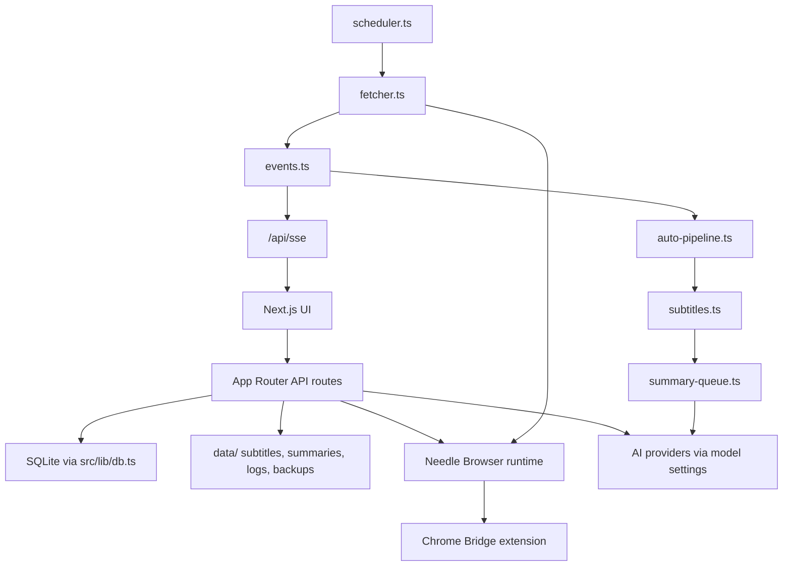
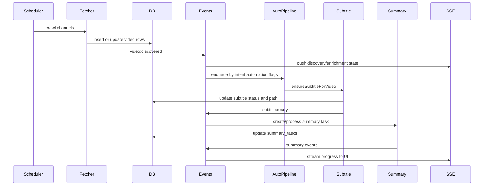

# 项目细节

[English](./project-details.md)

最后源码扫描日期：2026-05-30。

本文描述当前源码行为。`docs/design/` 与 `docs/specs/` 下的旧文件有历史价值，但当作现状前需要先对照源码。

## 顶层地图

| 路径 | 角色 |
| --- | --- |
| `src/app/` | Next.js App Router 页面与 API 路由 |
| `src/components/` | React UI 组件 |
| `src/components/settings/` | 设置页 tab 组件 |
| `src/lib/` | 服务端数据库、爬虫、流水线、AI、browser、备份、研究逻辑 |
| `src/hooks/` | Media Session 等 client hooks |
| `src/contexts/` | 主题、语言、性能 contexts |
| `src/mcp-server/` | 供意图 Agent 使用的 stdio MCP server |
| `browser-runtime/` | 第一方 browser daemon CLI |
| `browser-bridge/extension/` | Chrome 扩展源码 |
| `browser-bridge-package/` | 预构建扩展产物 |
| `eval/` | 字幕流水线评测 harness |
| `scripts/` | 备份、恢复、停止、导出和运行时 helper scripts |
| `data/` | 运行时数据，gitignored |

## 运行时数据布局

```text
data/
  folo.db
  subtitles/<platform>/<videoId>/
  summaries/<platform>/<videoId>.md
  summary-md/<platform>/<videoId>.md
  agent-artifacts/<intentName>/
  logs/
  backups/
```

## 架构



核心单例服务通过 `globalThis` 抵抗 Next.js 热更新重复实例化：scheduler、manual refresh state、auto-pipeline、summary queue、events、shared AI budget。

## 主要页面

| Route | 文件 | 用途 |
| --- | --- | --- |
| `/` | `src/app/page.tsx` | 视频流，支持意图/主题/平台过滤 |
| `/channels` | `src/app/channels/page.tsx` | 频道管理 |
| `/settings` | `src/app/settings/page.tsx` | 设置页 shell，通过 `?tab=` 切换 |
| `/research` | `src/app/research/page.tsx` | 研究收藏工作台 |
| `/research/collections/[id]` | `src/app/research/collections/[id]/page.tsx` | 集合详情页 |

## API 路由清单

以下路由来自 `src/app/api/**/route.ts` 扫描。

| 分组 | 路由 |
| --- | --- |
| 备份 | `GET /api/backup/download`, `GET/POST /api/backup/restore` |
| Bilibili | `GET/POST /api/bilibili/following`, `POST /api/bilibili/following/browser`, `GET/HEAD /api/bilibili/media`, `GET /api/bilibili/playback`, `GET /api/bilibili/summary` |
| Browser | `GET /api/browser/bridge`, `POST /api/browser/keepalive` |
| 频道 | `GET/POST /api/channels`, `PATCH/DELETE /api/channels/[id]`, `POST /api/channels/bulk-update`, `GET/POST /api/channels/markdown` |
| 爬虫/运行时 | `GET/POST /api/crawl-runtime`, `GET /api/crawler/status`, `POST /api/crawler/pause`, `POST /api/task-queues/clear` |
| 日志/SSE | `GET /api/logs`, `GET /api/logs/stats`, `GET /api/sse` |
| 研究 | `GET/POST/PATCH /api/research/favorites`, `DELETE /api/research/favorites/[id]`, `POST /api/research/favorites/from-url`, `GET/POST /api/research/intent-types`, `PATCH/DELETE /api/research/intent-types/[id]`, `GET/POST /api/research/collections`, `GET/PATCH/DELETE /api/research/collections/[id]`, `POST/PATCH/DELETE /api/research/collections/[id]/items`, `POST /api/research/exports`, `GET /api/research/videos/resolve` |
| 设置 | `GET/POST /api/settings/ai-summary`, `POST /api/settings/ai-summary/test`, `GET/POST /api/settings/bilibili-auth`, `GET/POST /api/settings/browser-keepalive`, `GET/POST /api/settings/crawler-performance`, `GET/POST /api/settings/error-handling`, `GET /api/settings/error-handling/videos`, `GET /api/settings/forced-aligner-status`, `GET/POST /api/settings/frontend-performance`, `GET/POST /api/settings/home-intent-shortcuts`, `GET/POST /api/settings/intents`, `PATCH/DELETE /api/settings/intents/[id]`, `POST /api/settings/intents/reorder`, `GET/POST /api/settings/player-keyboard-mode`, `GET/POST /api/settings/subtitle-pipeline`, `GET /api/settings/whisper-status` |
| 订阅导入 | `GET/POST /api/subscriptions/youtube`, `POST /api/subscriptions/youtube/browser`, `POST /api/subscriptions/import` |
| 摘要任务 | `GET /api/summary-tasks`, `POST/DELETE /api/summary-tasks/process`, `POST /api/summary-tasks/retry`, `GET /api/summary-tasks/stats` |
| 视频 | `GET/PATCH /api/videos`, `GET /api/videos/lookup`, `POST/DELETE /api/videos/refresh`, `GET/POST /api/videos/[id]/subtitle`, `GET /api/videos/[id]/summary`, `POST /api/videos/[id]/summary/generate`, `GET /api/videos/[id]/comments`, `POST /api/videos/[id]/repair`, `POST /api/videos/[id]/chat`, `GET/POST /api/videos/[id]/chat/artifacts` |
| YouTube media | `GET /api/youtube/playback`, `GET/HEAD /api/youtube/media` |

## 数据库表

定义与迁移在 `src/lib/db.ts`。

| 表 | 用途 |
| --- | --- |
| `channels` | 平台频道记录、intent、topics、爬取退避、元数据 |
| `videos` | 视频元数据、已读状态、可用性、字幕状态/路径/语言/格式/错误、重试/冷却、自动化 tags |
| `app_settings` | 按 key 存储 JSON 设置文档 |
| `intents` | 意图排序、自动化开关、意图级摘要模型、Agent prompt/trigger/memory |
| `summary_tasks` | 摘要队列状态、重试状态、状态时间戳 |
| `research_intent_types` | 研究收藏分类预设/自定义类型 |
| `research_favorites` | 收藏的视频、备注、归档状态 |
| `research_collections` | 命名研究集合 |
| `research_collection_items` | 集合成员与条目覆盖 |
| `chat_artifacts` | 视频的持久化 chat/笔记产物 |

## 流水线流程



## 当前流水线来源

| 流水线 | 来源 |
| --- | --- |
| 爬取 | YouTube 与 Bilibili 都是 `browser` |
| 字幕 | `browser`, `whisper-ai`, `llm-aligner`, `gemini` |

`llm-aligner` 存在但默认关闭。存储过的流水线设置会被 `src/lib/pipeline-config.ts` 归一化，因此已移除的旧 source 不会继续作为运行时选项。

## AI 与 Prompt 设置

AI 设置在 `src/lib/ai-summary-settings.ts` 中，配置文档版本为 `6`。

当前 prompt template keys：

- `default`
- `subtitleApi`
- `subtitleSegment`
- `chatObsidian`
- `chatRoast`

当前 provider protocols：

- `openai-chat`
- `gemini`
- `anthropic-messages`

共享 AI 预算由 `src/lib/shared-ai-budget.ts` 管理，被摘要、Gemini/多模态字幕 fallback 和 chat 共用。手动任务优先级高于自动任务。

## 重要实现注意

- `better-sqlite3` 是同步且服务端专用的。不要在 client component 里 import `src/lib/db.ts`。
- Settings API 没有 `/api/settings` 根 CRUD 路由；每个设置块都有自己的子路由。
- `channels.intent` 是文本，不是 foreign key。删除意图会把频道重置到默认未分类意图。
- `channels.topics` 和若干 automation 字段以 JSON 字符串存进 SQLite。
- Bilibili WBI 签名缓存在 `src/lib/wbi.ts`；绕过它会破坏很多 Bilibili API 调用。
- 依赖浏览器的爬取需要 runtime daemon 和 Chrome 扩展都可用。
- 移动端音频模式在 `EmbeddedPlayer` 里使用 Media Session 与静音音频心跳。

## 历史文档

以下目录适合做设计考古：

- `docs/design/`
- `docs/specs/`
- `docs/validation/`
- `docs/validations/`

它们可能描述计划、验证记录或旧实现。判断当前行为时，以本文列出的源码为准。
